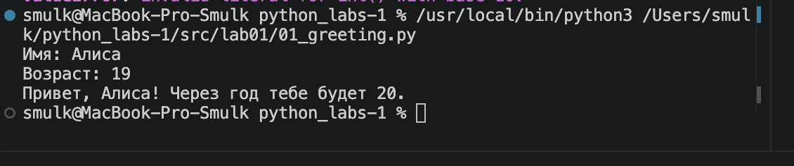

# Лабораторная работа №1

## Задание 1 — Привет и возраст

Программа получает имя и возраст пользователя и выводит,
сколько ему будет лет через год.

### Результат выполнения

## Задание 2 — Сумма и среднее

Программа получает два вещественных числа и вычисляет
их сумму и среднее арифметическое.

### Результат выполнения

## Задание 3 — Чек: скидка и НДС

Программа рассчитывает стоимость товара после скидки,
сумму НДС и итоговую стоимость.

### Результат выполнения

## Задание 4 — Минуты → ЧЧ:ММ

Программа переводит количество минут в часы и минуты.

### Результат выполнения

## Задание 5 — Инициалы и длина строки

Программа получает ФИО, определяет инициалы и длину строки
без лишних пробелов.

### Результат выполнения

