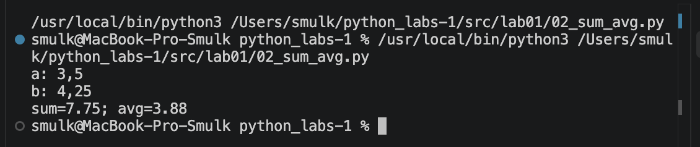
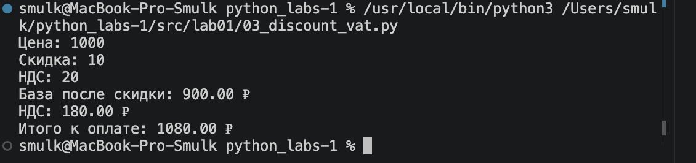
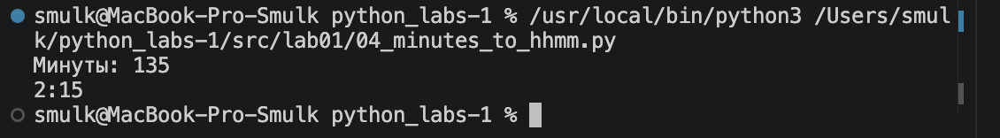
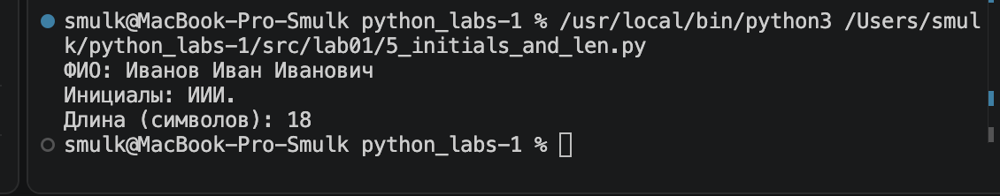

# Лабораторная работа №1

## Задание 1 

Программа получает имя и возраст пользователя и выводит,
сколько ему будет лет через год.

![1 задание] (images/lab01/img01.png)

## Задание 2 

Программа получает два вещественных числа и вычисляет
их сумму и среднее арифметическое.

## Задание 3 

Программа рассчитывает стоимость товара после скидки,
сумму НДС и итоговую стоимость.

## Задание 4 

Программа переводит количество минут в часы и минуты.

## Задание 5 

Программа получает ФИО, определяет инициалы и длину строки
без лишних пробелов.

